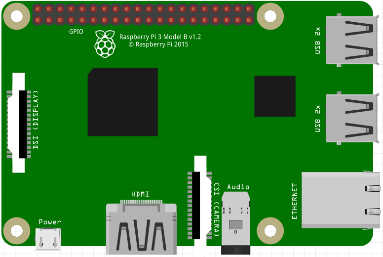

# Raspberry Pi 3 Kiosk

Implements `qt-webengine-kiosk` for rendering QtWebEngine.

This is the base Nerves System configuration for the Raspberry Pi 3 Model B.


<br><sup>[Image credit](#fritzing)</sup>

| Feature              | Description                     |
| -------------------- | ------------------------------- |
| CPU                  | 1.2 GHz quad-core ARMv8         |
| Memory               | 1 GB DRAM                       |
| Storage              | MicroSD                         |
| Linux kernel         | 4.19 w/ Raspberry Pi patches    |
| IEx terminal         | ttyS0                           |
| GPIO, I2C, SPI       | Yes - Elixir ALE                |
| ADC                  | No                              |
| PWM                  | Yes, but no Elixir support      |
| UART                 | 1 available - ttyS0             |
| Camera               | Yes - via rpi-userland          |
| Ethernet             | Yes                             |
| WiFi                 | Yes - Nerves.InterimWiFi        |
| Bluetooth            | Not yet                         |

## Using

The most common way of using this Nerves System is create a project with `mix
nerves.new` and to export `MIX_TARGET=rpi3`.

Then, change the rpi3 system dependency to
`{:kiosk_system_rpi3, "~> 1.0"}`

See the [Getting started
guide](https://hexdocs.pm/nerves/getting-started.html#creating-a-new-nerves-app)
for more information.

If you need custom modifications to this system for your device, clone this
repository and update as described in [Making custom
systems](https://hexdocs.pm/nerves/systems.html#customizing-your-own-nerves-system)

See the [example project](https://github.com/LeToteTeam/kiosk_system_rpi3/tree/master/example) for more info

## Built-in WiFi Firmware

WiFi modules almost always require proprietary firmware to be loaded for them to work. The
Linux kernel handles this and firmware blobs are maintained in the
`linux-firmware` project. The firmware for the built-in WiFi module on the RPi3
hasn't made it to the `linux-firmware` project nor Buildroot, so it is included
here in a `rootfs-additions` overlay directory. The original firmware files came from
https://github.com/RPi-Distro/firmware-nonfree/blob/master/brcm80211/brcm.

[Image credit](#fritzing): This image is from the [Fritzing](http://fritzing.org/home/) parts library.

## Provisioning devices

This system supports storing provisioning information in a small key-value store
outside of any filesystem. Provisioning is an optional step and reasonable
defaults are provided if this is missing.

Provisioning information can be queried using the Nerves.Runtime KV store's
[`Nerves.Runtime.KV.get/1`](https://hexdocs.pm/nerves_runtime/Nerves.Runtime.KV.html#get/1)
function.

Keys used by this system are:

Key                    | Example Value     | Description
:--------------------- | :---------------- | :----------
`nerves_serial_number` | "1234578"`        | By default, this string is used to create unique hostnames and Erlang node names. If unset, it defaults to part of the Raspberry Pi's device ID.

The normal procedure would be to set these keys once in manufacturing or before
deployment and then leave them alone.

For example, to provision a serial number on a running device, run the following
and reboot:

```elixir
iex> cmd("fw_setenv nerves_serial_number 1234")
```

This system supports setting the serial number offline. To do this, set the
`NERVES_SERIAL_NUMBER` environment variable when burning the firmware. If you're
programming MicroSD cards using `fwup`, the commandline is:

```sh
sudo NERVES_SERIAL_NUMBER=1234 fwup path_to_firmware.fw
```

Serial numbers are stored on the MicroSD card so if the MicroSD card is
replaced, the serial number will need to be reprogrammed. The numbers are stored
in a U-boot environment block. This is a special region that is separate from
the application partition so reformatting the application partition will not
lose the serial number or any other data stored in this block.
